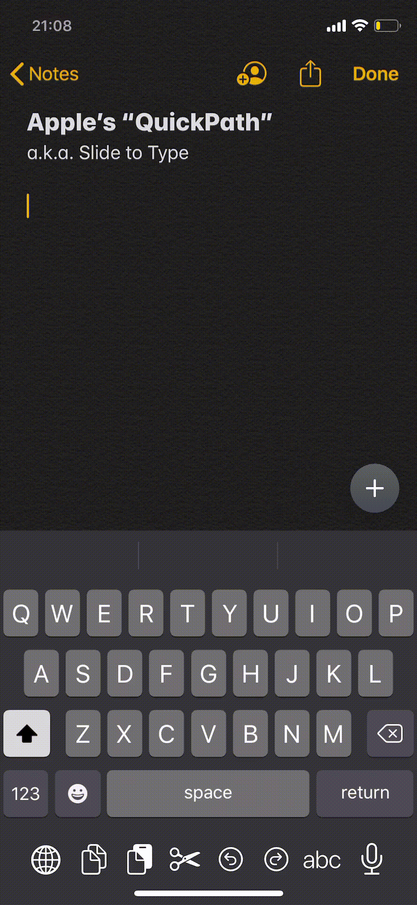

# 👈 TouchChaser
A touch indicator similar to the "Slide to Type" aka QuickPath swipe indicator on iOS 13+. Built with and for SwiftUI.

It's not an exact match but it's pretty close.

```swift 
VStack {
    Text("TouchChaser")
        .font(.title)
        .bold()
        .padding(.top, 50)
    Text("by Amzd")
        .font(.subheadline)
        .opacity(0.6)
        .padding(.top, 5)
    Spacer()
}.addTouchChaser(.always)
```

|  QuickPath                               |  TouchChaser                             |
|  --------------------------------------  |  --------------------------------------  |
|     |   |

*Gifs might not play in full speed on all browsers
